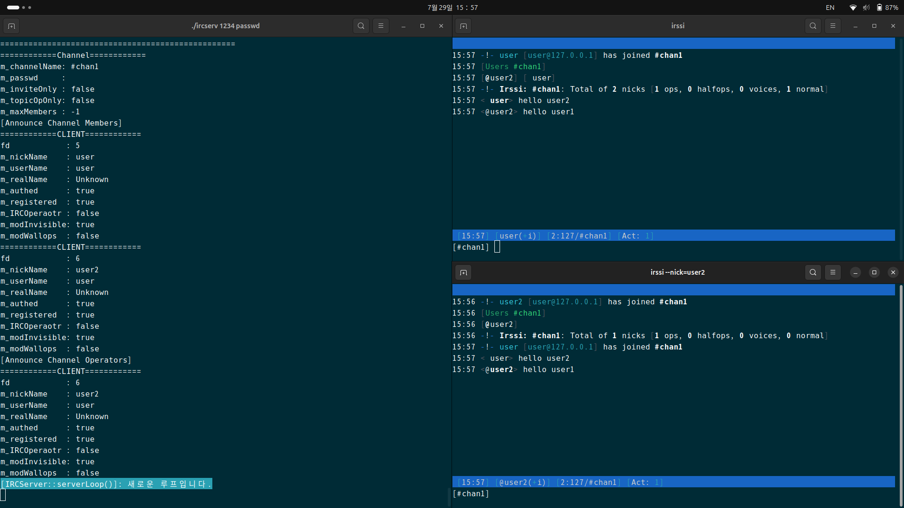

*이 프로젝트는 42 공통 교육과정의 일부로 hoysong이 제작했습니다.*

[English](./README.md) | [한국어](./README.ko.md)



# 1. 프로젝트 소개

ft_irc는 42 공통 교육과정의 일부로 C++98을 사용해 구현한 경량 IRC(Internet Relay Chat) 서버입니다. 단일 `epoll` 기반 이벤트 루프로 여러 클라이언트의 동시 연결을 처리합니다.

서버는 **RFC 1459**와 **RFC 2812**를 기반으로 한 IRC 프로토콜의 혼합된 하위 집합을 구현합니다. 사용자 인증, 닉네임 및 사용자 이름 등록, 채널 관리, 개인 메시지, 운영자 권한과 같은 핵심 기능을 지원합니다. **irssi**를 기준 클라이언트로 사용하며, **netcat**(`nc`)이나 **telnet** 같은 기본 도구를 통한 접속도 지원합니다.

서버 간 통신은 구현되어 있지 않습니다. 이 프로젝트는 RFC 명세에 정의된 클라이언트와 서버 간의 통신에만 집중합니다.

# 2. 구현 범위

이 저장소의 서버를 독립적으로 설계하고 구현했습니다. 이벤트 루프, 소켓과 클라이언트 생명주기, 수신 버퍼, IRC 메시지 파싱과 명령 디스패치, 채널 관리, 프로토콜 명령 처리, 응답 생성 및 통합 과정의 오류 수정을 모두 담당했습니다.

# 3. 요청 처리 흐름

```text
클라이언트 연결
    ↓
ListenSocket이 연결 수락
    ↓
ClientManager가 Client를 생성하고 관리
    ↓
EpollManager가 소켓 이벤트를 등록하고 대기
    ↓
Client가 수신한 바이트를 자신의 버퍼에 누적
    ↓
Client::popLine()이 CRLF로 끝난 완전한 메시지를 추출
    ↓
IRCServer가 메시지를 파싱하고 명령 처리 함수로 전달
    ↓
명령 처리 함수가 클라이언트·채널 상태를 변경하고 응답 전송
```

TCP의 한 번의 수신이 IRC 메시지 하나와 일치한다는 보장은 없습니다. 따라서 각 `Client`가 별도의 수신 버퍼를 보유합니다. 서버는 `\r\n`으로 끝난 메시지만 처리하고, 완성되지 않은 데이터는 다음 수신 이벤트까지 보관합니다. 여러 메시지가 한 번에 수신되면 같은 반복문에서 차례로 추출합니다.

# 4. 구성 요소별 책임

| 구성 요소 | 책임 |
| --- | --- |
| `ListenSocket` | 서버 소켓 생성, 바인드, 리슨 및 클라이언트 연결 수락 |
| `EpollManager` | `epoll` 인스턴스와 이벤트 등록·삭제·대기 관리 |
| `Client` | 연결·등록 상태, 수신 버퍼 및 참여 채널 정보 보관 |
| `ClientManager` | 연결된 클라이언트 생성·검색·제거 |
| `Channel` / `ChannelManager` | 채널 멤버·운영자·초대·토픽·채널 모드 관리 |
| `IRCServer` | 이벤트 루프 실행, 메시지 파싱, 명령 디스패치 및 매니저 조정 |
| `Msg` | IRC 프로토콜 응답과 숫자 응답 생성 |

# 5. 주요 설계 선택

- **단일 `epoll` 이벤트 루프:** 연결마다 별도 프로세스를 생성하지 않고 리슨 소켓과 모든 클라이언트 소켓을 처리합니다.
- **클라이언트별 수신 버퍼:** 분할되거나 연속으로 들어온 TCP 데이터를 CRLF 경계의 완전한 IRC 메시지로 변환합니다.
- **함수 포인터 디스패치 맵:** `PASS`, `NICK`, `JOIN`, `PRIVMSG` 등의 명령 문자열을 `IRCServer` 멤버 함수와 연결합니다.
- **상태 관리 책임 분리:** 클라이언트와 채널 상태 관리를 소켓 이벤트 처리 및 메시지 생성과 분리했습니다.

# 6. 기능

지원 기능의 전체 목록과 명령어별 사용법은 [IRC 명령어 사용법](./docs/COMMANDS.ko.md)에서 확인할 수 있습니다.

# 7. 기술적 특징 및 제약 사항

- **C++98**로 작성
- 여러 클라이언트를 동시에 처리
- 모든 I/O 다중화에 단일 **`epoll` 인스턴스** 사용
- **TCP/IP(IPv4)** 통신
- 프로세스 분기(fork) 없음
- **irssi**를 기준 클라이언트 구현체로 사용하며, 다른 IRC 클라이언트와의 상호작용은 보장하지 않음

# 8. 사용 방법

## 8.1. 사전 요구 사항

### 8.1.1. 빌드 및 실행 환경

- `epoll`을 지원하는 **Linux** 환경
- C++98을 지원하는 C++ 컴파일러(예: `c++`, `g++`, `clang++`)
- GNU Make

### 8.1.2. 접속 및 테스트 도구

- **irssi** — 기준 클라이언트를 이용한 접속 및 동작 검증에 필요
- **netcat**(`nc`) — 원시 IRC 명령을 직접 전송할 때 선택적으로 사용

## 8.2. 빌드

저장소를 복제하고 컴파일합니다.

```bash
git clone <repository-url>
cd ft_irc
make
```

그 밖의 Make 타깃은 다음과 같습니다.

| 타깃 | 설명 |
| --- | --- |
| `make` | 프로젝트를 컴파일하고 `ircserv` 실행 파일 생성 |
| `make clean` | 오브젝트 파일 삭제 |
| `make fclean` | 오브젝트 파일과 실행 파일 삭제 |
| `make re` | `fclean` 실행 후 `make` 실행 |

## 8.3. 서버 실행

```bash
./ircserv <port> <password>
```

- `<port>` — 서버가 클라이언트의 연결을 기다릴 포트 번호
- `<password>` — 클라이언트가 제출해야 하는 연결 비밀번호

**예시:**

```bash
./ircserv 6667 mypassword
```

## 8.4. IRC 클라이언트(irssi)로 연결

### 8.4.1. 방법 1

1. irssi를 실행합니다.

```bash
irssi
```

2. irssi 실행 후 다음 명령을 입력합니다.

```irssi
/connect 127.0.0.1 6667 mypassword
```

### 8.4.2. 방법 2

irssi를 옵션과 함께 실행합니다.

```bash
irssi -c 127.0.0.1 -p 6667 -n mynick --password="mypasswd"
```

## 8.5. Netcat으로 연결

1. 터미널에서 netcat을 실행합니다.

```bash
nc -C 127.0.0.1 6667
```

2. 직접 인증 명령어를 입력합니다.

```text
PASS mypassword
NICK mynick
USER myuser 0 * :My Real Name
```

> **참고:** RFC 표준에 따라 IRC 메시지는 `\r\n`으로 끝나므로 `-C` 옵션을 사용합니다.

## 8.6. 실행 참고사항

- [기능 미리보기](./docs/COMMANDS.ko.md#1-기능-미리보기)의 명령은 대소문자를 구별하지 않습니다.
- [연결 및 등록](./docs/COMMANDS.ko.md#21-연결-및-등록)을 완료하기 전에는 등록 명령 외의 명령을 처리하지 않습니다.
- netcat과 irssi는 서로 다른 프로그램이며, irssi가 제공하는 클라이언트 명령은 netcat에서 사용할 수 없습니다.

# 9. 참고 자료

## 9.1. 참조 문서

- [RFC 1459 — Internet Relay Chat Protocol](https://datatracker.ietf.org/doc/html/rfc1459)
- [RFC 2812 — Internet Relay Chat: Client Protocol](https://datatracker.ietf.org/doc/html/rfc2812)
- [Modern IRC Client Protocol Documentation](https://modern.ircdocs.horse)
- [IRC/2 Numeric List](https://www.alien.net.au/irc/irc2numerics.html)

## 9.2. AI 사용 내역

이 프로젝트를 개발하는 동안 다음 영역에서 AI 도구를 사용했습니다.

- **RFC 해석** — RFC 1459와 RFC 2812의 모호한 부분, 특히 명령어 파싱의 예외 상황과 예상되는 서버 동작을 명확히 하는 데 활용
- **오류 코드 및 응답 매핑** — 각 명령어에 알맞은 숫자 응답을 식별하고 명령어별 오류/응답 표를 구성하는 데 활용
- **README 작성** — 문서의 구조와 내용을 작성하는 데 활용
- **코드 리뷰 아이디어 도출** — 코드 리뷰를 위한 제안을 생성하고 프로토콜 처리 로직의 잠재적 문제를 식별하는 데 활용
- **반복적인 리팩터링** — 함수 시그니처 변경 후 모든 호출부를 수정하는 것과 같은 기계적인 리팩터링 작업에 활용

---
